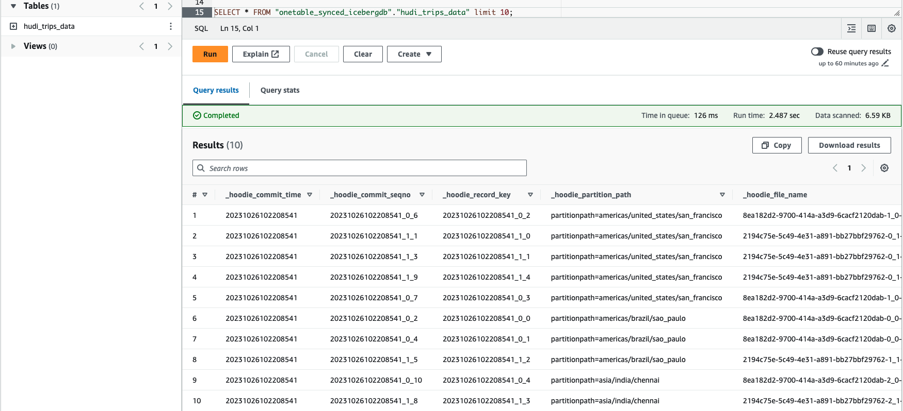

# Glue Data Catalog
This document walks through the steps to create a Onetable synced Iceberg table in Glue Data Catalog on AWS.
You will also be able to run this example with Delta as target format.

## Pre-requisites
1. Hudi table(s) already written to Amazon S3.
   If you don't have a Hudi table written in S3, you can follow the steps in [this](https://link-to-how-to.md) tutorial to set it up.
2. Setup access to interact with AWS APIs from the command line.
   If you haven’t installed AWSCLIv2, you do so by following the steps outlined in
   [AWS docs](https://docs.aws.amazon.com/cli/latest/userguide/getting-started-install.html) and
   also set up access credentials by following the steps
   [here](https://docs.aws.amazon.com/cli/latest/userguide/getting-started-quickstart.html).
3. Clone the onetable github [repository](https://github.com/onetable-io/onetable) and create the `utilities-0.1.0-SNAPSHOT-bundled.jar`
   by following the steps [here](https://github.com/onetable-io/onetable#building-the-project-and-running-tests).

## Steps

### Running sync
Create `my_config.yaml` in the cloned onetable directory.

 ```yaml md title="yaml"
 sourceFormat: HUDI
 targetFormats:
   - ICEBERG
 datasets:
   -
     tableBasePath: s3://path/to/trips_data
     tableName: hudi_trips_data
     partitionSpec: partitionpath:VALUE
 ```
:::tip Note:
Replace `ICEBERG` with `DELTA` if you wish to create the target table in Delta format.
:::

From your terminal under the cloned onetable directory, run the sync process using the below command.

 ```shell md title="shell"
 java -jar utilities/target/utilities-0.1.0-SNAPSHOT-bundled.jar -datasetConfig my_config.yaml
 ```

:::tip Note:
At this point, if you check your bucket path, you will be able to see the `metadata` directory
with metadata files which contains the information that helps query engines interpret the data as an Iceberg table.
:::

### Register the target table in Glue Data Catalog
From your terminal, create a glue database.
   
 ```shell md title="shell"
 aws glue create-database --database-input "{\"Name\":\"onetable_synced_db\"}"
 ```

From your terminal, create a glue crawler. Modify the `<yourAccountId>`, `<yourRoleName>` 
and `<path/to/your/data>`, with appropriate values.

```shell md title="shell"
export accountId=<yourAccountId>
export roleName=<yourRoleName>
export s3DataPath=s3://<path/to/trips_data>
```
```shell md title="shell"
aws glue create-crawler --name onetable_crawler --role arn:aws:iam::${accountId}:role/service-role/${roleName} --database onetable_synced_db --targets "{\"IcebergTargets\":[{\"Paths\":[\"${s3DataPath}\"]}]}"
```
:::tip Note:
Replace `IcebergTargets` with `DeltaTargets` if you wish to create the target table in Delta format.
:::

From your terminal, run the glue crawler.

```shell md title="shell"
 aws glue start-crawler --name onetable_crawler
```
Once the crawler succeeds, you’ll be able to query this Iceberg table from Athena,
EMR and/or Redshift query engines.

### Validating the results
Here’s how our table looks like in Amazon Athena.



## Conclusion:
In this guide we saw how to, 
1. sync a Hudi table to create Iceberg metadata with Onetable
2. catalog the data as an Iceberg table in Glue Data Catalog
3. validate the Onetable synced Iceberg table in Amazon Athena
